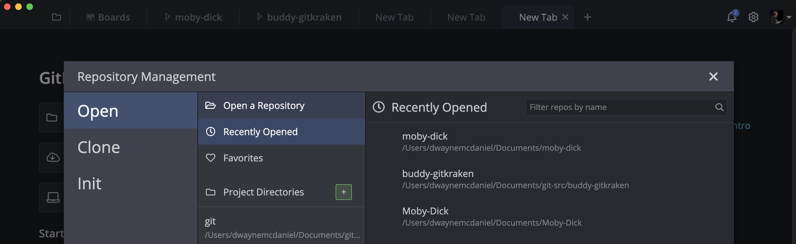
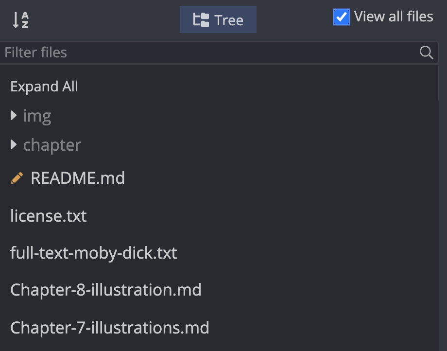

# GitKraken Clone Example Repo
## Featuring Moby Dick

### Hi there and congrats on progressing with your exploration of Git and GitKraken 👋

This branch is meant to provide an example of committing and reverting from GitHub using GitKraken and Git CLI.  

You can follow along with the [tutorial for "how to Git Commit?" on GitKraken.com](https://www.gitkraken.com/learn/git/tutorials/how-to-git-commit?utm_source=learn%20gi[…]20tutorial%20link&utm_campaign=git%20clone%20practice%20repo).

#### Set up:

If you have not already done so, you will also need to [download GitKraken.][1]

[][1]

## Git Commit a file with GitKraken

1. Open this local repository with GitKraken by clicking on the folder icon in the upper left, choosing 'Open a repo' and selecting the folder where you cloned this repository.

2. In the right hand menu you can see if any files are changed locally.  Since none have been changed a we just opened the file, click on the 'View all files' checkbox to show all the files in the directory.  

3. Click on `full-text-moby-dick.txt`. This will open up the file in built in editor inside GitKraken.  If you prefer to use another editor to open and work with the file, right mouse click the file instead and select your desired option.  

4. Edit the file as much as you like and save your changes (ctl/cmd-s). Perhaps you want to change the author to be you, or maybe use cmd/ctl-f find and replace Ishmael with your own name throughout the text. 

5. Now uncheck the 'View all files' box and you will see only the modified file in the view.  It is being tracked by Git and GtKraken is showing it as ready to be staged.  

6. Click the top most node on the graph which is labeled `//WIP`.  This will change the menu on the right hand side to the staging and commit view.  The files you changed will now appear in the 'Unstaged Files' area

7. You can either click the "Stage all changes" button or hover over the individual files and click on the 'Stage File' button that appears. Aternatively, you can click on the file to be taken to the Diff view where you can stage individual changed lines in your document.  

8. One you have staged the files, write a commit message in the 'Commit Message' 'Summary' and 'Description' fields.  Summaries are limited to 72 characters but Descriptions can be as long as you like.

9. Click the 'Commit Changes' button once you are happy with your commit message.  

**Congratulations!**  

You have successfully edited a file and made a commit with GitKraken 🎉

*Now, let's try it with the CLI...*

## Git Commit a file with the Git CLI

1. Find and open the file `full-text-moby-dick.txt` with your favorite text editor.

2. Edit the file as much as you like and save your changes. 

3. Open your terminal or git-bash and navigate to the locally cloned repository containing `full-text-moby-dick.txt`

4. Type `git status` and hit enter to show the current state of the git repository.  It should show that the file you have saved is `modified` under the 'Changes not staged for commit' part of the message.

5. Type `git add full-text-moby-dick.txt` and hit enter to stage the file. By default there is no feedback from this command if successful.  You can add the 'verbose' flag to the command to get a little more insight by running `git add full-text-moby-dick.txt -v` instead.

6. Again type `git status` and hit enter.  You will now see the file listed under the 'Changes to be committed' part of the message.

7. You are now ready to commit and enter your commit message. To do this as a single step, type `git commit -m 'YOUR COMMIT MESSAGE GOES HERE'` and hit enter. 

Note: If you run only `git commit` Git will open the commit message to be edited by the default text editor in your terminal.  This is typically a program called `vim`. While this a powerful editor it is tricky to navigate for new users.  If you find youself in this unfamiliar editor, type `i` to go into 'insert mode', which will allow you to navigate and type as you like. Then hit the `esc` key and type `:wq` to tell the editor to write(save) your changes and quit the application.  You can read more about `vim` at [https://www.vim.org/](https://www.vim.org/)

**Congratulations!**  

You have successfully committed a file with the Git CLI.

## Next Steps

You are reading this on the `git-commit` branch of this repository.  

To continue on to practice reverting commits you can switch to the `git-revert` branch.  

To switch branches if you are reading this on GitHub, click the `banches` option towards the top left of the code view and select the branch you want to navigate to.  

To checkout the branch locally and pull from the online branch in the CLI type `git checkout -b git-revert origin/git-revert`

To checkout the branch locally using GitKraken, simply click on the `git revert` branch in the Remote menu on the right hand side.  

[1]: https://www.gitkraken.com/download?utm_source=learn%20git%20practice%20repo&utm_medium=README%20gk%20download%20link&utm_campaign=git%20clone%20practice%20repo